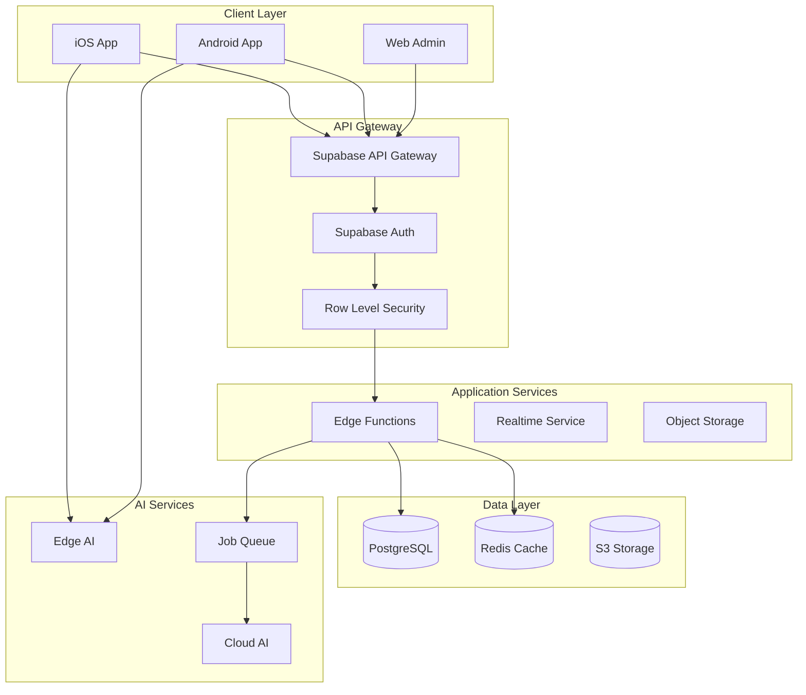

# Phase 3: Detailed Architecture Design

## Executive Summary

Comprehensive architecture design for VibeStack implementing microservices pattern with React Native frontend, Supabase backend, and hybrid AI processing. Architecture supports 1M+ concurrent users with healthcare-grade security.

## System Architecture Overview



## Component Architecture

### 1. Frontend Architecture (React Native + Expo)

```typescript
// Project Structure
vibestack-app/
├── app/                    # Expo Router navigation
│   ├── (auth)/            # Authentication flow
│   │   ├── login.tsx
│   │   ├── register.tsx
│   │   └── onboarding.tsx
│   ├── (tabs)/            # Main app tabs
│   │   ├── _layout.tsx
│   │   ├── home.tsx
│   │   ├── habits.tsx
│   │   ├── avatar.tsx
│   │   ├── social.tsx
│   │   └── profile.tsx
│   └── _layout.tsx        # Root layout
├── components/            # Reusable components
│   ├── ui/               # Base UI components
│   │   ├── Button.tsx
│   │   ├── Card.tsx
│   │   └── Input.tsx
│   ├── habits/           # Habit tracking components
│   │   ├── HabitCard.tsx
│   │   ├── StreakCounter.tsx
│   │   └── ProgressChart.tsx
│   ├── avatar/           # Avatar components
│   │   ├── AvatarBuilder.tsx
│   │   ├── ChatInterface.tsx
│   │   └── PersonalitySelector.tsx
│   └── social/           # Social components
│       ├── ChallengeCard.tsx
│       ├── Leaderboard.tsx
│       └── ShareModal.tsx
├── features/             # Feature modules
│   ├── behavioral-analysis/
│   ├── avatar-companion/
│   ├── social-gamification/
│   └── monetization/
├── services/             # External services
│   ├── supabase.ts
│   ├── ai-services.ts
│   ├── analytics.ts
│   └── notifications.ts
├── stores/               # Zustand stores
│   ├── userStore.ts
│   ├── habitStore.ts
│   ├── avatarStore.ts
│   └── socialStore.ts
└── utils/                # Utilities
    ├── constants.ts
    ├── helpers.ts
    └── types.ts
```

### 2. State Management Architecture

```typescript
// Zustand Store Example: Avatar Store
import { create } from 'zustand'
import { persist, createJSONStorage } from 'zustand/middleware'
import AsyncStorage from '@react-native-async-storage/async-storage'

interface AvatarState {
  // State
  avatar: {
    id: string
    appearance: AvatarAppearance
    personality: PersonalityType
    memories: Memory[]
    emotions: EmotionState
  }
  conversation: {
    messages: Message[]
    isTyping: boolean
    context: ConversationContext
  }
  
  // Actions
  updateAppearance: (appearance: Partial<AvatarAppearance>) => void
  setPersonality: (personality: PersonalityType) => void
  addMemory: (memory: Memory) => void
  updateEmotion: (emotion: Emotion) => void
  sendMessage: (message: string) => Promise<void>
}

export const useAvatarStore = create<AvatarState>()(
  persist(
    (set, get) => ({
      avatar: {
        id: '',
        appearance: defaultAppearance,
        personality: 'encouraging',
        memories: [],
        emotions: { mood: 'happy', energy: 0.8 }
      },
      conversation: {
        messages: [],
        isTyping: false,
        context: {}
      },
      
      updateAppearance: (appearance) => 
        set((state) => ({
          avatar: {
            ...state.avatar,
            appearance: { ...state.avatar.appearance, ...appearance }
          }
        })),
      
      setPersonality: (personality) =>
        set((state) => ({
          avatar: { ...state.avatar, personality }
        })),
      
      addMemory: (memory) =>
        set((state) => ({
          avatar: {
            ...state.avatar,
            memories: [...state.avatar.memories, memory].slice(-100)
          }
        })),
      
      updateEmotion: (emotion) =>
        set((state) => ({
          avatar: {
            ...state.avatar,
            emotions: calculateEmotions(state.avatar.emotions, emotion)
          }
        })),
      
      sendMessage: async (message) => {
        set({ conversation: { ...get().conversation, isTyping: true } })
        
        try {
          const response = await aiService.chat({
            message,
            personality: get().avatar.personality,
            context: get().conversation.context,
            memories: get().avatar.memories
          })
          
          set((state) => ({
            conversation: {
              messages: [...state.conversation.messages, 
                { role: 'user', content: message },
                { role: 'assistant', content: response }
              ],
              isTyping: false,
              context: response.context
            }
          }))
        } catch (error) {
          set({ conversation: { ...get().conversation, isTyping: false } })
          throw error
        }
      }
    }),
    {
      name: 'avatar-storage',
      storage: createJSONStorage(() => AsyncStorage),
      partialize: (state) => ({ avatar: state.avatar })
    }
  )
)
```

### 3. Data Architecture

#### Database Schema (PostgreSQL)

```sql
-- Users and Authentication
CREATE TABLE users (
    id UUID PRIMARY KEY DEFAULT gen_random_uuid(),
    email TEXT UNIQUE NOT NULL,
    created_at TIMESTAMPTZ DEFAULT NOW(),
    updated_at TIMESTAMPTZ DEFAULT NOW(),
    metadata JSONB DEFAULT '{}'::jsonb
);

-- User Profiles
CREATE TABLE profiles (
    id UUID PRIMARY KEY REFERENCES users(id) ON DELETE CASCADE,
    username TEXT UNIQUE,
    display_name TEXT,
    avatar_url TEXT,
    bio TEXT,
    preferences JSONB DEFAULT '{}'::jsonb,
    onboarding_completed BOOLEAN DEFAULT FALSE,
    created_at TIMESTAMPTZ DEFAULT NOW(),
    updated_at TIMESTAMPTZ DEFAULT NOW()
);

-- Habits
CREATE TABLE habits (
    id UUID PRIMARY KEY DEFAULT gen_random_uuid(),
    name TEXT NOT NULL,
    description TEXT,
    category TEXT NOT NULL,
    difficulty INTEGER CHECK (difficulty >= 1 AND difficulty <= 10),
    icon TEXT,
    color TEXT,
    metadata JSONB DEFAULT '{}'::jsonb,
    created_at TIMESTAMPTZ DEFAULT NOW()
);

-- User Habits (Assignment)
CREATE TABLE user_habits (
    id UUID PRIMARY KEY DEFAULT gen_random_uuid(),
    user_id UUID REFERENCES users(id) ON DELETE CASCADE,
    habit_id UUID REFERENCES habits(id),
    assigned_at TIMESTAMPTZ DEFAULT NOW(),
    status TEXT DEFAULT 'active',
    ai_confidence FLOAT,
    assignment_reason JSONB,
    UNIQUE(user_id, habit_id)
);

-- Habit Check-ins
CREATE TABLE habit_checkins (
    id UUID PRIMARY KEY DEFAULT gen_random_uuid(),
    user_id UUID REFERENCES users(id) ON DELETE CASCADE,
    habit_id UUID REFERENCES habits(id),
    completed BOOLEAN DEFAULT FALSE,
    checkin_date DATE DEFAULT CURRENT_DATE,
    checkin_time TIMESTAMPTZ DEFAULT NOW(),
    mood TEXT,
    notes TEXT,
    metadata JSONB DEFAULT '{}'::jsonb,
    UNIQUE(user_id, habit_id, checkin_date)
);

-- Behavioral Events
CREATE TABLE behavior_events (
    id UUID PRIMARY KEY DEFAULT gen_random_uuid(),
    user_id UUID REFERENCES users(id) ON DELETE CASCADE,
    event_type TEXT NOT NULL,
    event_data JSONB NOT NULL,
    device_info JSONB,
    created_at TIMESTAMPTZ DEFAULT NOW(),
    processed BOOLEAN DEFAULT FALSE
);

-- Create indexes for performance
CREATE INDEX idx_behavior_events_user_created ON behavior_events(user_id, created_at DESC);
CREATE INDEX idx_behavior_events_type ON behavior_events(event_type);
CREATE INDEX idx_habit_checkins_user_date ON habit_checkins(user_id, checkin_date DESC);

-- Avatars
CREATE TABLE avatars (
    id UUID PRIMARY KEY DEFAULT gen_random_uuid(),
    user_id UUID UNIQUE REFERENCES users(id) ON DELETE CASCADE,
    appearance JSONB NOT NULL,
    personality TEXT NOT NULL,
    memories JSONB[] DEFAULT ARRAY[]::JSONB[],
    emotion_state JSONB DEFAULT '{}'::jsonb,
    created_at TIMESTAMPTZ DEFAULT NOW(),
    updated_at TIMESTAMPTZ DEFAULT NOW()
);

-- Conversations
CREATE TABLE conversations (
    id UUID PRIMARY KEY DEFAULT gen_random_uuid(),
    user_id UUID REFERENCES users(id) ON DELETE CASCADE,
    messages JSONB[] NOT NULL,
    context JSONB DEFAULT '{}'::jsonb,
    created_at TIMESTAMPTZ DEFAULT NOW(),
    updated_at TIMESTAMPTZ DEFAULT NOW()
);

-- Social Features
CREATE TABLE friendships (
    id UUID PRIMARY KEY DEFAULT gen_random_uuid(),
    user_id UUID REFERENCES users(id) ON DELETE CASCADE,
    friend_id UUID REFERENCES users(id) ON DELETE CASCADE,
    status TEXT DEFAULT 'pending',
    created_at TIMESTAMPTZ DEFAULT NOW(),
    UNIQUE(user_id, friend_id),
    CHECK (user_id != friend_id)
);

-- Challenges
CREATE TABLE challenges (
    id UUID PRIMARY KEY DEFAULT gen_random_uuid(),
    creator_id UUID REFERENCES users(id) ON DELETE CASCADE,
    habit_id UUID REFERENCES habits(id),
    name TEXT NOT NULL,
    description TEXT,
    start_date TIMESTAMPTZ NOT NULL,
    end_date TIMESTAMPTZ NOT NULL,
    type TEXT NOT NULL, -- '1v1', 'group', 'public'
    settings JSONB DEFAULT '{}'::jsonb,
    created_at TIMESTAMPTZ DEFAULT NOW()
);

-- Challenge Participants
CREATE TABLE challenge_participants (
    id UUID PRIMARY KEY DEFAULT gen_random_uuid(),
    challenge_id UUID REFERENCES challenges(id) ON DELETE CASCADE,
    user_id UUID REFERENCES users(id) ON DELETE CASCADE,
    joined_at TIMESTAMPTZ DEFAULT NOW(),
    score INTEGER DEFAULT 0,
    rank INTEGER,
    UNIQUE(challenge_id, user_id)
);

-- Row Level Security Policies
ALTER TABLE profiles ENABLE ROW LEVEL SECURITY;
ALTER TABLE user_habits ENABLE ROW LEVEL SECURITY;
ALTER TABLE habit_checkins ENABLE ROW LEVEL SECURITY;
ALTER TABLE behavior_events ENABLE ROW LEVEL SECURITY;
ALTER TABLE avatars ENABLE ROW LEVEL SECURITY;
ALTER TABLE conversations ENABLE ROW LEVEL SECURITY;

-- Example RLS Policy
CREATE POLICY "Users can view own profile" ON profiles
    FOR SELECT USING (auth.uid() = id);

CREATE POLICY "Users can update own profile" ON profiles
    FOR UPDATE USING (auth.uid() = id);
```

### 4. API Architecture (Supabase Edge Functions)

```typescript
// Edge Function: Habit Assignment
import { serve } from 'https://deno.land/std@0.168.0/http/server.ts'
import { createClient } from 'https://esm.sh/@supabase/supabase-js@2'

interface BehaviorAnalysis {
  sleepPattern: number
  activityLevel: number
  screenTime: number
  stressLevel: number
}

serve(async (req: Request) => {
  try {
    const { userId } = await req.json()
    
    const supabase = createClient(
      Deno.env.get('SUPABASE_URL') ?? '',
      Deno.env.get('SUPABASE_SERVICE_ROLE_KEY') ?? ''
    )
    
    // Get user's behavioral data
    const { data: events } = await supabase
      .from('behavior_events')
      .select('*')
      .eq('user_id', userId)
      .gte('created_at', new Date(Date.now() - 30 * 24 * 60 * 60 * 1000).toISOString())
      .order('created_at', { ascending: false })
    
    // Analyze behavior patterns
    const analysis = analyzeBehaviorPatterns(events)
    
    // Get optimal habit based on analysis
    const habit = await selectOptimalHabit(analysis)
    
    // Assign habit to user
    const { data: assignment } = await supabase
      .from('user_habits')
      .insert({
        user_id: userId,
        habit_id: habit.id,
        ai_confidence: habit.confidence,
        assignment_reason: {
          analysis,
          reasoning: habit.reasoning
        }
      })
      .select()
      .single()
    
    return new Response(
      JSON.stringify({ success: true, assignment }),
      { headers: { 'Content-Type': 'application/json' } }
    )
  } catch (error) {
    return new Response(
      JSON.stringify({ error: error.message }),
      { status: 400, headers: { 'Content-Type': 'application/json' } }
    )
  }
})

function analyzeBehaviorPatterns(events: any[]): BehaviorAnalysis {
  // Implementation of behavior analysis algorithm
  // This would process the events and extract patterns
  return {
    sleepPattern: 0.7,
    activityLevel: 0.5,
    screenTime: 0.8,
    stressLevel: 0.6
  }
}

async function selectOptimalHabit(analysis: BehaviorAnalysis) {
  // Habit selection logic based on analysis
  // This would use ML model or rule-based system
  return {
    id: 'habit-uuid',
    confidence: 0.85,
    reasoning: 'Based on high screen time and moderate stress levels'
  }
}
```

### 5. Real-time Architecture

```typescript
// Real-time Challenge Updates
import { RealtimeChannel } from '@supabase/supabase-js'

class ChallengeRealtimeService {
  private channels: Map<string, RealtimeChannel> = new Map()
  
  subscribeToChallengeUpdates(challengeId: string, handlers: {
    onParticipantJoined?: (participant: Participant) => void
    onProgressUpdate?: (update: ProgressUpdate) => void
    onLeaderboardChange?: (leaderboard: LeaderboardEntry[]) => void
  }) {
    const channelName = `challenge:${challengeId}`
    
    if (this.channels.has(channelName)) {
      return this.channels.get(channelName)!
    }
    
    const channel = supabase
      .channel(channelName)
      .on('broadcast', { event: 'participant_joined' }, ({ payload }) => {
        handlers.onParticipantJoined?.(payload)
      })
      .on('broadcast', { event: 'progress_update' }, ({ payload }) => {
        handlers.onProgressUpdate?.(payload)
      })
      .on('broadcast', { event: 'leaderboard_change' }, ({ payload }) => {
        handlers.onLeaderboardChange?.(payload)
      })
      .subscribe()
    
    this.channels.set(channelName, channel)
    return channel
  }
  
  async updateProgress(challengeId: string, progress: number) {
    const channel = this.channels.get(`challenge:${challengeId}`)
    if (!channel) return
    
    await channel.send({
      type: 'broadcast',
      event: 'progress_update',
      payload: {
        userId: getCurrentUserId(),
        progress,
        timestamp: new Date().toISOString()
      }
    })
  }
  
  unsubscribe(challengeId: string) {
    const channelName = `challenge:${challengeId}`
    const channel = this.channels.get(channelName)
    
    if (channel) {
      supabase.removeChannel(channel)
      this.channels.delete(channelName)
    }
  }
}
```

### 6. AI Service Architecture

```typescript
// AI Service with Multi-Provider Support
import { createAI } from '@vercel/ai'
import { openai } from '@ai-sdk/openai'
import { anthropic } from '@ai-sdk/anthropic'
import { google } from '@ai-sdk/google'

class AIService {
  private providers = {
    openai: openai('gpt-4-turbo'),
    anthropic: anthropic('claude-3-opus-20240229'),
    google: google('gemini-pro')
  }
  
  async generateAvatarResponse(
    message: string,
    personality: PersonalityType,
    context: ConversationContext
  ) {
    const systemPrompt = this.buildSystemPrompt(personality, context)
    
    try {
      // Try primary provider
      const response = await this.providers.openai.generateText({
        system: systemPrompt,
        messages: [{ role: 'user', content: message }],
        temperature: 0.7,
        maxTokens: 500
      })
      
      return response
    } catch (error) {
      // Fallback to secondary provider
      console.error('Primary AI provider failed:', error)
      
      const response = await this.providers.anthropic.generateText({
        system: systemPrompt,
        messages: [{ role: 'user', content: message }],
        temperature: 0.7,
        maxTokens: 500
      })
      
      return response
    }
  }
  
  private buildSystemPrompt(personality: PersonalityType, context: ConversationContext): string {
    const personalityPrompts = {
      encouraging: `You are an encouraging and supportive companion who celebrates small wins and provides gentle motivation. You speak with warmth and positivity.`,
      drillSergeant: `You are a no-nonsense motivator who pushes users to achieve their goals. You're tough but fair, using direct language.`,
      zenMaster: `You are a calm and wise guide who helps users find balance and mindfulness in their habit journey. You speak with tranquility and insight.`,
      dataAnalyst: `You are an analytical companion who provides data-driven insights and recommendations. You speak precisely and focus on metrics.`
    }
    
    return `${personalityPrompts[personality]}
    
    Context: ${JSON.stringify(context)}
    
    Remember to:
    - Stay in character
    - Reference the user's habit progress when relevant
    - Keep responses concise and actionable
    - Show genuine interest in the user's wellbeing`
  }
}
```

### 7. Infrastructure Architecture

#### Kubernetes Deployment

```yaml
# Backend API Deployment
apiVersion: apps/v1
kind: Deployment
metadata:
  name: vibestack-api
  namespace: production
spec:
  replicas: 3
  selector:
    matchLabels:
      app: vibestack-api
  template:
    metadata:
      labels:
        app: vibestack-api
    spec:
      containers:
      - name: api
        image: vibestack/api:latest
        ports:
        - containerPort: 3000
        env:
        - name: SUPABASE_URL
          valueFrom:
            secretKeyRef:
              name: vibestack-secrets
              key: supabase-url
        - name: SUPABASE_SERVICE_KEY
          valueFrom:
            secretKeyRef:
              name: vibestack-secrets
              key: supabase-service-key
        resources:
          requests:
            memory: "256Mi"
            cpu: "250m"
          limits:
            memory: "512Mi"
            cpu: "500m"
        livenessProbe:
          httpGet:
            path: /health
            port: 3000
          initialDelaySeconds: 30
          periodSeconds: 10
        readinessProbe:
          httpGet:
            path: /ready
            port: 3000
          initialDelaySeconds: 5
          periodSeconds: 5

---
# Horizontal Pod Autoscaler
apiVersion: autoscaling/v2
kind: HorizontalPodAutoscaler
metadata:
  name: vibestack-api-hpa
  namespace: production
spec:
  scaleTargetRef:
    apiVersion: apps/v1
    kind: Deployment
    name: vibestack-api
  minReplicas: 3
  maxReplicas: 50
  metrics:
  - type: Resource
    resource:
      name: cpu
      target:
        type: Utilization
        averageUtilization: 70
  - type: Resource
    resource:
      name: memory
      target:
        type: Utilization
        averageUtilization: 80

---
# Redis Cache Deployment
apiVersion: apps/v1
kind: Deployment
metadata:
  name: vibestack-redis
  namespace: production
spec:
  replicas: 1
  selector:
    matchLabels:
      app: vibestack-redis
  template:
    metadata:
      labels:
        app: vibestack-redis
    spec:
      containers:
      - name: redis
        image: redis:7-alpine
        ports:
        - containerPort: 6379
        command: ["redis-server"]
        args: ["--requirepass", "$(REDIS_PASSWORD)"]
        env:
        - name: REDIS_PASSWORD
          valueFrom:
            secretKeyRef:
              name: vibestack-secrets
              key: redis-password
        resources:
          requests:
            memory: "256Mi"
            cpu: "100m"
          limits:
            memory: "512Mi"
            cpu: "200m"
        volumeMounts:
        - name: redis-data
          mountPath: /data
      volumes:
      - name: redis-data
        persistentVolumeClaim:
          claimName: redis-pvc
```

#### Monitoring Stack

```yaml
# Prometheus Configuration
apiVersion: v1
kind: ConfigMap
metadata:
  name: prometheus-config
  namespace: monitoring
data:
  prometheus.yml: |
    global:
      scrape_interval: 15s
      evaluation_interval: 15s
    
    scrape_configs:
    - job_name: 'vibestack-api'
      kubernetes_sd_configs:
      - role: pod
        namespaces:
          names:
          - production
      relabel_configs:
      - source_labels: [__meta_kubernetes_pod_label_app]
        action: keep
        regex: vibestack-api
      - source_labels: [__meta_kubernetes_pod_name]
        target_label: pod
      - source_labels: [__meta_kubernetes_namespace]
        target_label: namespace
    
    - job_name: 'node-exporter'
      kubernetes_sd_configs:
      - role: node
      relabel_configs:
      - source_labels: [__address__]
        regex: '(.*):10250'
        replacement: '${1}:9100'
        target_label: __address__

---
# Grafana Dashboard
apiVersion: v1
kind: ConfigMap
metadata:
  name: vibestack-dashboard
  namespace: monitoring
data:
  dashboard.json: |
    {
      "dashboard": {
        "title": "VibeStack Metrics",
        "panels": [
          {
            "title": "API Response Time",
            "targets": [{
              "expr": "histogram_quantile(0.95, http_request_duration_seconds_bucket)"
            }]
          },
          {
            "title": "Active Users",
            "targets": [{
              "expr": "vibestack_active_users_total"
            }]
          },
          {
            "title": "Habit Check-ins/Hour",
            "targets": [{
              "expr": "rate(vibestack_habit_checkins_total[1h])"
            }]
          },
          {
            "title": "AI API Calls",
            "targets": [{
              "expr": "sum(rate(vibestack_ai_api_calls_total[5m])) by (provider)"
            }]
          }
        ]
      }
    }
```

### 8. Security Architecture

```typescript
// Security Middleware
export class SecurityMiddleware {
  // Rate Limiting
  static rateLimiter = rateLimit({
    windowMs: 15 * 60 * 1000, // 15 minutes
    max: 100, // limit each IP to 100 requests per windowMs
    message: 'Too many requests from this IP',
    standardHeaders: true,
    legacyHeaders: false,
  })
  
  // CORS Configuration
  static cors = cors({
    origin: process.env.ALLOWED_ORIGINS?.split(',') || ['http://localhost:3000'],
    credentials: true,
    optionsSuccessStatus: 200
  })
  
  // Helmet Security Headers
  static helmet = helmet({
    contentSecurityPolicy: {
      directives: {
        defaultSrc: ["'self'"],
        styleSrc: ["'self'", "'unsafe-inline'"],
        scriptSrc: ["'self'"],
        imgSrc: ["'self'", "data:", "https:"],
        connectSrc: ["'self'", "wss:", "https:"],
        fontSrc: ["'self'"],
        objectSrc: ["'none'"],
        mediaSrc: ["'self'"],
        frameSrc: ["'none'"],
      },
    },
    hsts: {
      maxAge: 31536000,
      includeSubDomains: true,
      preload: true
    }
  })
  
  // Input Validation
  static validateInput = (schema: any) => {
    return (req: Request, res: Response, next: NextFunction) => {
      const { error } = schema.validate(req.body)
      if (error) {
        return res.status(400).json({
          error: 'Validation error',
          details: error.details
        })
      }
      next()
    }
  }
  
  // JWT Verification
  static async verifyJWT(req: Request, res: Response, next: NextFunction) {
    try {
      const token = req.headers.authorization?.split(' ')[1]
      if (!token) {
        return res.status(401).json({ error: 'No token provided' })
      }
      
      const { data, error } = await supabase.auth.getUser(token)
      if (error) throw error
      
      req.user = data.user
      next()
    } catch (error) {
      return res.status(401).json({ error: 'Invalid token' })
    }
  }
}
```

## Next Steps

Phase 4 will implement:
- Backend infrastructure setup
- Core component development with TDD
- API implementation
- Frontend component library
- Integration testing

---

*Architecture design completed: June 11, 2025*
*Based on: Requirements + Pseudocode + 2025 best practices*